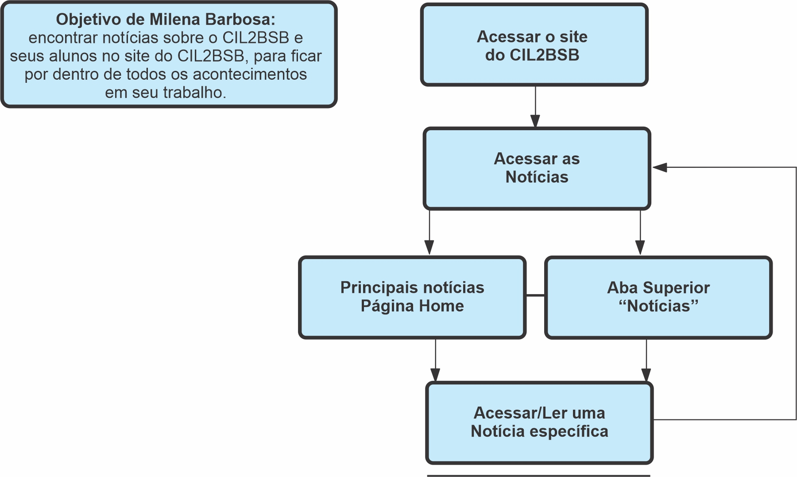

## Histórico de Versões

| Data       | Versão | Descrição                                                | Autores                             | Revisor |
| ---------- | ------ | -------------------------------------------------------- | ----------------------------------- | ------- |
| 12/03/2021 | 0.1    | Criação do Documento                                     | Eduarda, Luis Marques, Herya, Pedro | ------- |
| 15/03/2021 | 0.2    | Descrição da análise GOMS                                | Hérya                               | Eduarda |
| 15/03/2021 | 0.3    | Objetivos e Análise de Tarefas da Persona Secundária     | Eduarda Servidio                    | ------- |

## 1. Definição

"Uma análise de tarefas é utilizada para se ter um entendimento sobre qual é o trabalho dos usuários, como
eles o realizam e por quê. Nesse tipo de análise, o trabalho é definido em termos dos objetivos que os
usuários querem ou precisam atingir."(Barbosa e Silva, 2019)

## 2. Objetivo

A análise terá como foco melhorar as funcionalidades do site CIL2BSB, bem como sua estética. Assim sendo, faremos uma análise a partir de 3 personas para entendermos melhor sobre o uso do site, bem como obter maiores informações.

## 3. Análise Hierárquica de Tarefas
###3.1 Personas primárias

###3.2 Persona Secundária
####3.2.1 Milena Barbosa

Nossa análise de persona secundária tem como foco Milena Barbosa, 38 anos, professora de língua inglesa do CIL2-BSB que pretende estar ciente de todas as possíveis notícias que envolvem o CIL2BSB através do site deles.

_Figura3: Análise de Tarefas Persona Secundária. Autor: Eduarda Servidio._

| Objetivos                      | Recomendações                                                                                                      |
| ------------------------------ | ------------------------------------------------------------------------------------------------------------------ |
| Acessar o site do CIL2BSB      | <b>Ação</b>: entrar no site http://www.cil2bsb.com.br/                                                             |
| Acessar as notícias            | <b>Ação</b>: selecionar uma notícia na Página Home. Ou <b>Ação</b>: selecionar na aba superior "Notícias"          |
| Acessar uma notícia específica | <b>Ação</b>: selecionar uma notícia específica do site CIL2BSB. <b>Plano</b>: Conseguir ter acesso a alguma notícia|

## 4. Análise GOMS
###4.1 Definição Análise GOMS

GOMS é um método para analisar o desempenho de usuários de sistemas computacionais, realizando tarefas dentro da sua competência e sem cometer erros. Esse método descreve uma tarefa e o conhecimento do usuário sobre como realizá-la em termos de objetivos, operadores, métodos e regras de seleção.

1) Objetivos: são aquilo que o usuário deseja realizar utilizando o sistema.

2) Operadores: são as ações que o sistema permite que o usuário faça.

3) Métodos: são sequências bem conhecidas de subobjetivos e operadores que permitam que o um objetivo maior seja atingido.

4) Regras de seleção: são as tomadas de decisão dos usuários sobre qual método utilizar em uma situação.
Há diferentes modelos GOMS, como KLM e CMN-GOMS.

### 4.2  KLM
###4.2.1 Definição KLM

É uma técnica GOMS simples, a qual limita-se a um conjunto predefinido de operadores.

### 4.3 CMN-GOMS
###4.3.1 Definição CMN-GOMS

É a proposta original do GOMS. "Há uma hierarquia estrita de objetivos, os operadores são executados estritamente em ordem sequencial, e os métodos são representados numa notação semelhante a um pseudocódigo, que inclui submétodos e condicionais."(Barbosa e Silva, 2019)

Será realizada a análise de CMN-GOMS para cada uma das personas primárias apresentadas.

## Referências Bibliográficas

BARBOSA, Simone et al. "Interação Humano-Computador". 

