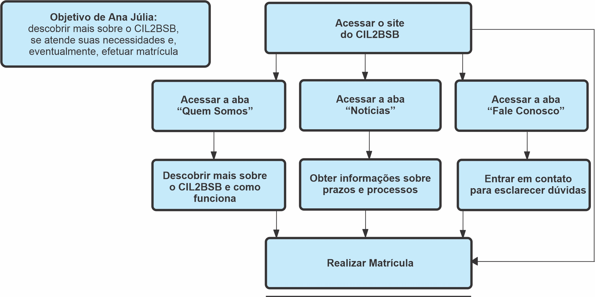
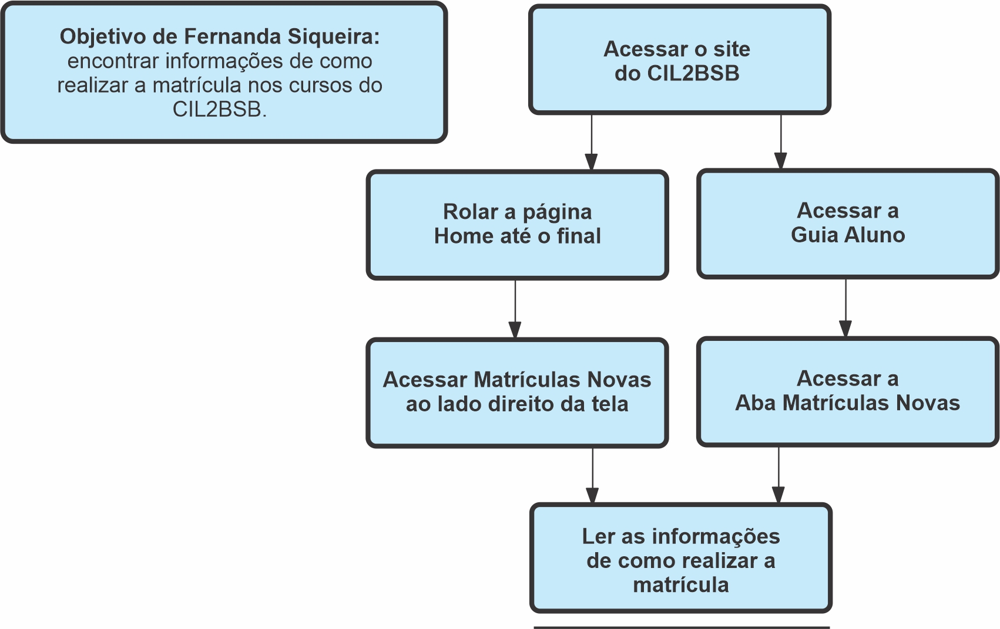

## Histórico de Versões

| Data       | Versão | Descrição                                            | Autores                                 | Revisor |
| ---------- | ------ | ---------------------------------------------------- | -----------------------------------     | ------- |
| 12/03/2021 | 0.1    | Criação do Documento                                 | Eduarda, Luis Marques, Herya, Pedro     | ------- |
| 15/03/2021 | 0.2    | Descrição da análise GOMS                            | Hérya                                   | Eduarda |
| 15/03/2021 | 0.3    | Objetivos e Análise de Tarefas da Persona Secundária | Eduarda Servidio                        | Hérya   |
| 16/03/2021 | 0.4    | Adição de analise, e GOMS da persona 2               | Luis Marques                            | Eduarda |
| 16/03/2021 | 0.5    | Correção: Análise de GOMS e Complementação: Esquema da Análise de Tarefas (Persona Primaria 2) | Eduarda Servidio | Pedro Haick |
| 16/03/2021 | 0.6    | Análise de tarefas e GOMS da persona 1               | Pedro Haick                             | ------- |

## 1. Definição

"Uma análise de tarefas é utilizada para se ter um entendimento sobre qual é o trabalho dos usuários, como
eles o realizam e por quê. Nesse tipo de análise, o trabalho é definido em termos dos objetivos que os
usuários querem ou precisam atingir." (Barbosa e Silva, 2019)

## 2. Objetivo

A análise terá como foco melhorar as funcionalidades do site CIL2BSB, bem como sua estética. Assim sendo, faremos uma análise a partir de 3 personas para entendermos melhor sobre o uso do site, bem como obter maiores informações.

## 3. Análise Hierárquica de Tarefas

###3.1 Personas primárias

####3.1.1

A primeira análise de persona primária será de Ana Júlia Silva, 16 anos, que quer descobrir mais sobre o CIL2-BSB e aprender a utilizar o site.

_Figura1: Análise de Tarefas Persona Primária 1. Autor: Pedro Haick._

| Objetivos                                     | Recomendações                                          |
| --------------------------------------------- | ------------------------------------------------------ |
| Acessar o site do CIL2BSB                     | <b>Ação</b>: entrar no site http://www.cil2bsb.com.br/ |
| Se informar sobre o CIL2BSB                   | <b>Ação</b>: selecionar na aba superior "Quem Somos"   |
| Visualizar as notícias                        | <b>Ação</b>: selecionar na aba superior "Notícias"     |
| Entrar em contato                             | <b>Ação</b>: selecionar na aba superior "Fale conosco" |

####3.1.2 Fernanda Siqueira

Nossa segunda análise de persona primária será de Fernanda Siqueira, 17 anos, que busca informações de como realizar a matrícula no CIL2-BSB.

_Figura2: Análise de Tarefas Persona Primária 2. Autores: Luis Marques e Eduarda Servidio._

| Objetivos                                     | Recomendações                                          |
| --------------------------------------------- | ------------------------------------------------------ |
| Acessar o site do CIL2BSB                     | <b>Ação</b>: entrar no site http://www.cil2bsb.com.br/ |
| Acessar as opções para alunos                 | <b>Ação</b>: selecionar na aba superior "Alunos"       |
| Acessar as informações sobre novas matrículas | <b>Ação</b>: Selecionar na Matrículas novas            |

###3.2 Persona Secundária
####3.2.1 Milena Barbosa

Nossa análise de persona secundária tem como foco Milena Barbosa, 38 anos, professora de língua inglesa do CIL2-BSB que pretende estar ciente de todas as possíveis notícias que envolvem o CIL2BSB através do site deles.

_Figura3: Análise de Tarefas Persona Secundária. Autor: Eduarda Servidio._

| Objetivos                      | Recomendações                                                                                                       |
| ------------------------------ | ------------------------------------------------------------------------------------------------------------------- |
| Acessar o site do CIL2BSB      | <b>Ação</b>: entrar no site http://www.cil2bsb.com.br/                                                              |
| Acessar as notícias            | <b>Ação</b>: selecionar uma notícia na Página Home. Ou <b>Ação</b>: selecionar na aba superior "Notícias"           |
| Acessar uma notícia específica | <b>Ação</b>: selecionar uma notícia específica do site CIL2BSB. <b>Plano</b>: Conseguir ter acesso a alguma notícia |

## 4. Análise GOMS

###4.1 Definição Análise GOMS

GOMS é um método para analisar o desempenho de usuários de sistemas computacionais, realizando tarefas dentro da sua competência e sem cometer erros. Esse método descreve uma tarefa e o conhecimento do usuário sobre como realizá-la em termos de objetivos, operadores, métodos e regras de seleção.

1. Objetivos: são aquilo que o usuário deseja realizar utilizando o sistema.

2. Operadores: são as ações que o sistema permite que o usuário faça.

3. Métodos: são sequências bem conhecidas de subobjetivos e operadores que permitam que o um objetivo maior seja atingido.

4. Regras de seleção: são as tomadas de decisão dos usuários sobre qual método utilizar em uma situação.
   Há diferentes modelos GOMS, como KLM e CMN-GOMS.

### 4.2 KLM

###4.2.1 Definição KLM

É uma técnica GOMS simples, a qual limita-se a um conjunto predefinido de operadores.

### 4.3 CMN-GOMS

###4.3.1 Definição CMN-GOMS

É a proposta original do GOMS. "Há uma hierarquia estrita de objetivos, os operadores são executados estritamente em ordem sequencial, e os métodos são representados numa notação semelhante a um pseudocódigo, que inclui submétodos e condicionais." (Barbosa e Silva, 2019)

Será realizada a análise de CMN-GOMS para cada uma das personas primárias apresentadas.

### 4.4 Análises

Para a análise usaremos os seguintes termos

    Goal : Objetivo do usuário utilizando o sistema.
    OP : Ações concretas que o Cil2bsb oferece.
    METHOD : Sequência de subobjetivos e operadores para atingir um objetivo.

###4.4.1 Ana Júlia Silva

    Goal 0 : Acessar o site do CIL2BSB
        OP : Acessar o site http://www.cil2bsb.com.br/ em seu navegador de preferência.
    Goal 1 : Se informar sobre o CIL2BSB 
        OP : Passar o mouse sobre a aba "Quem Somos", no menu superior
            OP : Clicar em um tópico para se informar a respeito
    Goal 2 : Visualizar as notícias
        OP : Clicar com o mouse na aba de notícias, no menu superior
    Goal 3 : Entrar em contato
        OP : Clicar com o mouse na aba "Fale Conosco", no menu superior
        OP : Selecionar o melhor meio de contato disponível

###4.4.2 Fernanda Siqueira

    Goal 0 : Acessar o site do CIL2BSB
        OP : acessar o site http://www.cil2bsb.com.br/ em seu navegador de preferência.
    Goal 1 : Acessar a opção Matrículas Novas 
        OP : Primeira Opção: Levar o mouse para a aba superior "Alunos"
            OP : Realizar um clique com mouse para que abra o submenu
            OP : Acessar a opção específica no submenu
        OP : Segunda Opção: Rolar a página até o final (disponível ao lado direito da tela)
            OP : Acessar a opção específica no submenu
    Goal 2 : Acessar as informações sobre novas matrículas
        OP : Clicar com o mouse em Matrículas Novas

## Referências Bibliográficas

BARBOSA, Simone et al. "Interação Humano-Computador". 

