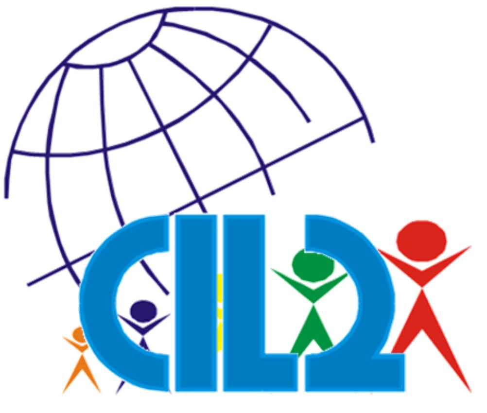
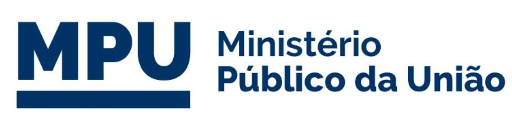
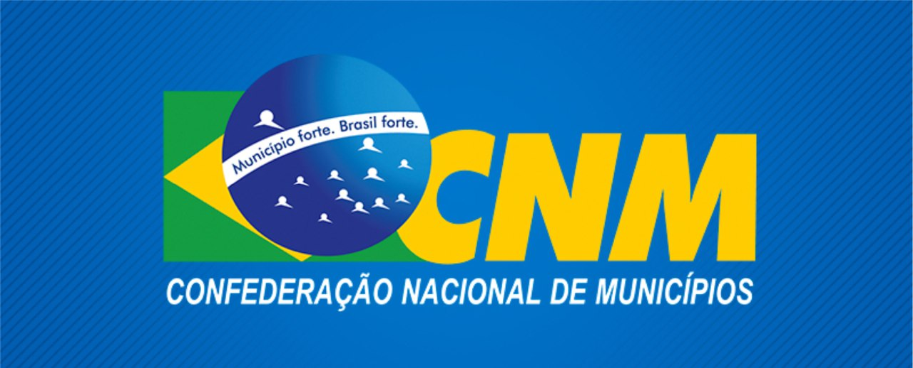
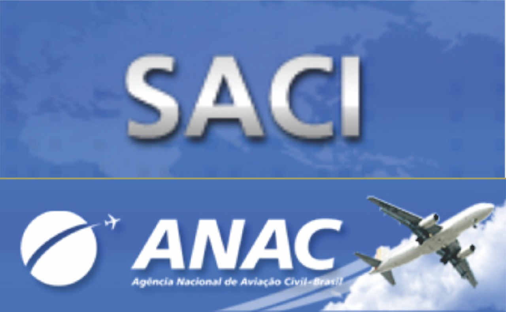
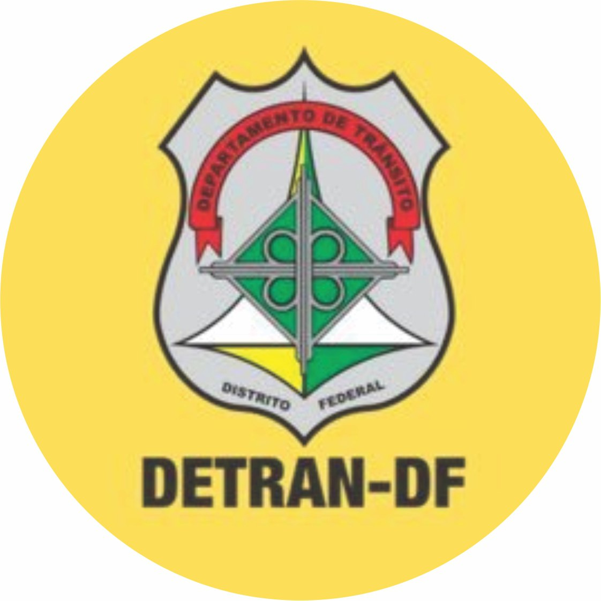
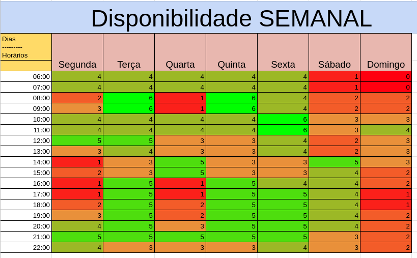

# Planejamento do Projeto

## Histórico de Versões

| Data       | Versão | Descrição                        | Autores                        | Revisor |
| ---------- | ------ | -------------------------------- | ------------------------------ | ------- |
| 02/03/2021 | 0.1    | Criação da Wiki Planejamento     | Gabriela Pivetta, Luis G.      | Eduarda |
| 02/03/2021 | 0.2    | Atualização da Wiki Planejamento | Gabriela, Luis, Eduarda, Herya | Eduarda |

## Justificativa de escolha do site

.

Em consenso, a equipe escolheu o site [CIL 2 BSB](http://www.cil2bsb.com.br/) para a realização do projeto da matéria Interação Humano-Computador. Vimos no site, um possível potencial de melhora, como por exemplo, melhorar a estética em geral.

## Outros sites analisados

| Logo | Nome | Descrição |
| ---- | ---- | --------- |
|  | [Ministério Público da União](http://www.mpu.mp.br/) | O site do Ministério Público da União foi avaliado pelos integrantes Pedro Haick é Gabriela Pivetta |
 | [Confederação Nacional de Municipios](https://www.cnm.org.br/) | O site da Confederação Nacional de Municipios foi avaliado pela integrante Herya Rodrigues |
|  | [Saci](https://sistemas.anac.gov.br/saci/) | O site do SACI foi avaliado pelo integrante Luis Marques e consiste em um portal que permite que o usuário realize o logbook (na aviação chamada de Caderneta Individual de Voo) de suas horas voadas, além de possibilitar a abertura de processos para conceção de licenças e habilitações para os aeronautas. |
|  | [Detran DF](http://www.detran.df.gov.br/) | O site da Confederação Nacional de Municipios foi avaliada pela integrante Eduarda Servidio |

## Heatmap

Os 6 membros da equipe possuem disponibilidade nas Sextas de 10h as 12h, bem como nas aulas assíncronas da disciplina.

## Cronograma das atividades

| Entrega                                                 | Data de entrega esperada | Data de entrega limite |
| ------------------------------------------------------- | ------------------------ | ---------------------- |
| Planejamento do Projeto                                 | 04/03/2021               | 05/03/2021             |
| Perfil do Usuário, Personas e Análise de Tarefas        | 12/03/2021               | 19/03/2021             |
| Princípios Gerais de Projeto                            | 19/03/2021               | 26/03/2021             |
| Planejamento de Avaliação e Planejamento dos Resultados | 02/04/2021               | 09/04/2021             |
| Relato dos resultados do Story Board                    | 16/04/2021               | 23/04/2021             |
| Relato dos resultados do Protótipo de papel             | 23/04/2021               | 30/04/2021             |
| Projeto Final                                           | 03/05/2021               | 10/05/2021             |

Estipulamos uma dedicação semanal de 8 horas por membro da equipe.

## Ferramentas

| Ferramenta                                                                                                                                                                                                                    | Nome               | Descrição                                                |
| ----------------------------------------------------------------------------------------------------------------------------------------------------------------------------------------------------------------------------- | ------------------ | -------------------------------------------------------- |
|                                                                                                              | Google Suite       | Ferramenta usada para auxílio na criação dos slides      |
|  | Microsoft Office   | Ferramenta para criação de planilhas                     |
|  | Microsoft Teams    | Ferramenta usada para reuniões em equipe                 |
|                                                                                                        | Telegram           | Ferramenta usada para comunicação entre os membros       |
|                                                                                  | Visual Studio Code | Ferramenta de edição de códigos utilizada pela equipe    |
|                                                                                                                            | GitHub             | Ferramenta usada para armazenar os documentos do projeto |
|                                                                                                                       | Photoshop          | Ferramenta usada para criação dos slides finais          |
|                                                                                                                             | MKdocs             | Ferramenta usada para criação do Site wiki do projeto.   |

## Contribuições para a Primeira Apresentação

| Realização                              | Membro que contribuiu                   |
| --------------------------------------- | --------------------------------------- |
| Escolha do site                         | Todos os membros                        |
| Primeira Avaliação do site              | Giovana Dionisio                        |
| Escolha das ferramentas                 | Eduarda, Gabriela, Giovana, Herya, Luis |
| Definição do cronograma                 | Eduarda, Gabriela, Giovana, Herya, Luis |
| Conteúdo dos Slides da apresentação     | Eduarda, Gabriela, Giovana, Herya, Luis |
| Design dos Slides                       | Eduarda Servidio                        |
| Gravação do Vídeo da Apresentação       | Todos os membros                        |
| Edição do vídeo/Link da Apresentação    | Luis Gustavo                            |
| Início da organização do Git do projeto | Eduarda S, Gabriela P, Luis G.          |
